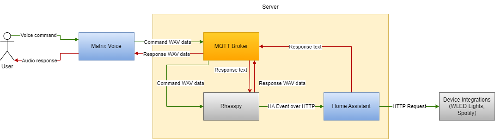

# Alexa 2.0

## Description

The Alexa 2.0 system is a voice assistant solution which uses an open-source software
stack to perform voice processing. It integrates the Matrix Voice for audio capture
along with a server software package which performs the voice processing and automation
processing entirely locally. The goal of this system is to provide users seeking an
alternative to commerical voice assistants with a software ecosystem that they are in
control of. This allow Alexa 2.0 to be inspectable and extendable. It protects the
privacy of the user by performing processing locally and can function without an
Internet connection.

## System Diagram

## Setup

It is recommended to set up the system in the following manner:

1. Set up the WLED module
    1. Assign the WLED module a static IP
        1. Connect the WLED to the network
        2. Open the web UI
        3. Navigate to the Settings and Wi-Fi Setup
        4. Assign the IP to `192.168.15.101`
        5. Assign the subnet mask as `255.255.255.0`
        6. Assign the gateway to 192.168.15.2
        7. Save settings and reboot the WLED module
2. Set up the server
    1. See the [server README](https://github.com/neu-ece-4534-sp23/sp23-prj-voice-home-automation/blob/main/server/README.md#usage)
    for details
    2. Download the Rhasspy files
        1. Navigate to the web UI at `localhost:12101`
        2. Click on the "Download external files" button
        3. Wait for the download to finish
3. Set up the Matrix Voice in stream mode
    1. See the [esp32_satellite README](./voice_matrix/esp32_satellite/README.md)
        - Similarly the local hot word detection version can be flashed by setting release 6.0.0 to local hot word detection and flashing but it did not work for us

## Structure

* docs/
    * The system diagram
* server/
    * Docker files for starting the server side audio processing
    * hass/
        * Home assistant Dockerfile
    * hass-data/
        * Home assistant configuration files
    * mqtt/
        * Mosquitto MQTT Dockerfile
    * mqtt-data/
        * MQTT configuration files
    * rhasspy/
        * Rhasspy Dockerfile
    * rhasspy-data/
        * Rhasspy configuration files
* voice_matrix/
    * esp32_satellite instructions and scripts to setup Matrix Stream mode
        * gpio_timing contains files for latency timing for satellite stream
    * raspberry_pi_integration for using the matrix from the raspberry pi using HAL
        * matrix_hal contains hal install and example code
        * rhasspy_integration contains rhasspy profile to use the matrix voice directly connected to a raspberry pi

## Matrix Stream Latency

### Overview

For quantafiable latency results we developed a method of using GPIO outputs to time notable events during each Rhasspy interaction. There were two aspects to this:
1. Developed a new version of the [StateMachine.hpp](./voice_matrix/raspberry_pi_integration/gpio_timing/StateMachine.hpp) file to toggle one of the ESP32's GPIO pins during notable events. This is better than timing on the matrix and printing because that is a more expensive proess than writing to a GPIO and affects the programs latency more.
    1. Play tone indicating hot word detected
    2. Play tone indicating no more audio being collected
    3. Play response audio based on the command
2. Developed [code](./voice_matrix/raspberry_pi_integration/gpio_timing/gpio_timing.c) on the Raspberry Pi to record these GPIO events (when the pin is pulled low). Did this using [pigpio](https://abyz.me.uk/rpi/pigpio/) with a callback function that runs whenever the state of the specified gpio pin changes, time accurate to a few us. 

Then connecting the GPIO from the matrix to the Raspberry Pi allows for recording of the latency of these events. May easily be adapted to record other events and even multiple gpio pins for different time differential measurements if desired.

### Setup
Follow the regular install instructions for using matrix stream but before flashing replace the StateMachine.hpp file in the ESP32-Rhasspy-Satellite Repository.

For the raspberry pi:
1. go to the [gpio_timing folder](./voice_matrix/raspberry_pi_integration/gpio_timing/)
2. run `make`
3. connect the io pin 25 on the matrix to GPIO 21 (pin 40) on the Raspberry Pi.
4. run `./gpio_timing 21`
5. speak commands to the matrix voice and timing results will be printed.

## Team Members/Initial Work Breakdown

Trevor McDonald: For sprint 1 I will complete the bring-up of the matrix voice array and helping to integrate this with the Raspberry Pi running Rhasspy. Initially we will start by using the on-board hot word detection and transferring the wav file over serial, and I will also look into options of programming the on-board ESP32 to convert the audio to text and transfer over the internet to a server. 

Brett Sullivan: For sprint 1, I will install [Rhasspy](https://rhasspy.readthedocs.io/en/latest/) locally on the Raspberry Pi to start processing audio from the MATRIX Voice. We will explore integrating Rhasspy with Home Assistant. Initially, Rhasspy will be run locally on the Raspberry Pi, but as we transition to using the ESP32, if the ESP32 is unable to handle the load locally, we may transmit the audio over MQTT and run Rhasspy remotely using an existing open source project, [ESP32 Rhasspy Satelite](https://github.com/Romkabouter/ESP32-Rhasspy-Satellite). I will explore Rhasspy's scripting possibilities and the events they generate, and implement a simple script to verify functionality.

Johnny Cao: For sprint 1, I will install [Home Assistant](https://www.home-assistant.io/) locally on my laptop and attempt to link up with Brett to get Home Assistant communicating with the Rhasspy instance that he will be working on getting set up. Rhasspy will be sending events to Home Assistant over a common MQTT broker. I will be responsible for also writing the automations needed to control the downstream devices from the events received through Rhasspy.

Iris Wang: For sprint 1 I will explore running FreeRTOS on the Matrix Voice ESP32. From my very initial research it looks like ESP-IDF is built on FreeRTOS and is the officially supported method of ESP32 development, but I will need to look into it if this is the correct path to go down or if some other FreeRTOS solution is needed for the project. Regardless of the outcome, initial steps include setting up an initial main function and spawning one task to ensure that it's working, then eventually integrating this with the actual software used to capture and send voice commands. For the sake of being thorough, what I eventually ended up actually doing was adding Spotify integrations including search functionality, which included setting Rhasspy speech-to-text options, creating new intents, adding Home Assistant automations, and writing a script to search and play songs.

