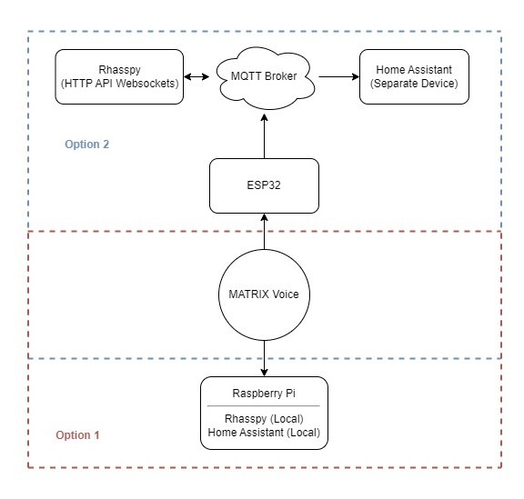

# voice-home-automation

## Description
Our initial concept is to develop a smart home voice control system that is local to protect the privacy of individuals in their home. Our first concept is to use the Matrix Voice that contains an ESP32 for hot word detection and transfer this audio data to a raspberry pi running Rhasspy. The raspberry pi will then locally detect the words and send home assistant commands to control a smart home. 

After this first concept we will have a better idea of which direction to take but one option may be to use the Matrix Voice's ESP32 to convert the audio to text and send the text over the wifi to a server. This server would then handle command parsing and smart home control. 

## System Diagram

## Team Members/Work Breakdown

Trevor McDonald: For sprint 1 I will complete the bring-up of the matrix voice array and helping to integrate this with the raspberry pi running Rhasspy. Initially we will start by using the on-board hot word detection and transferring the wav file over serial, and I will also look into options of programming the on-board ESP32 to convert the audio to text and transfer over the internet to a server. 

Brett Sullivan: For sprint 1, I will install [Rhasspy](https://rhasspy.readthedocs.io/en/latest/) locally on the Raspberry Pi to start processing audio from the MATRIX Voice. We will explore integrating Rhasspy with Home Assistant. Initially, Rhasspy will be run locally on the Raspberry Pi, but as we transition to using the ESP32, if the ESP32 is unable to handle the load locally, we may transmit the audio over MQTT and run Rhasspy remotely using an existing open source project, [ESP32 Rhasspy Satelite](https://github.com/Romkabouter/ESP32-Rhasspy-Satellite). I will explore Rhasspy's scripting possibilities and the events they generate, and implement a simple script to verify functionality.

Johnny Cao:

