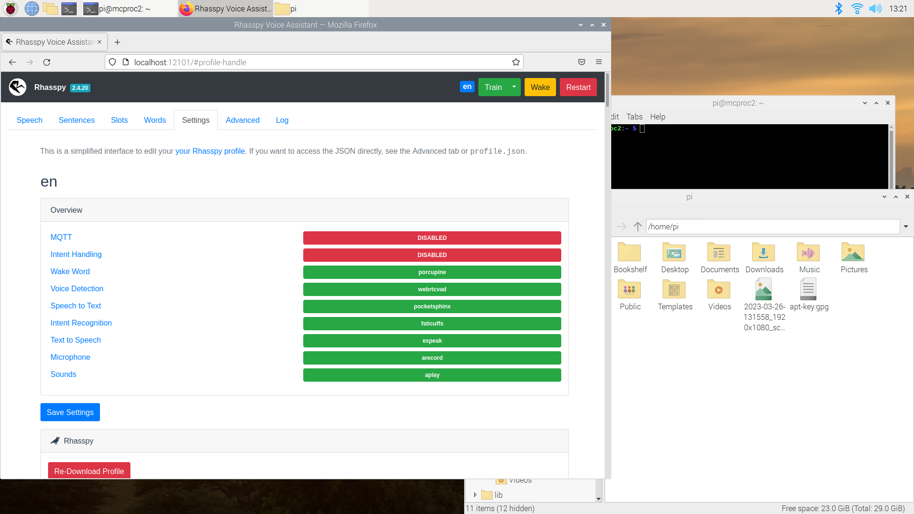
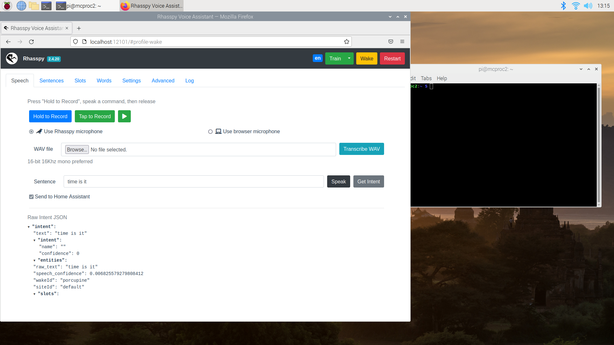

# Rhasspy Integration with the Matrix Voice

## Overview
This part of the project we installed Rhasspy on a raspberry pi and configured it to work with the attached Matrix Voice as a microphone. 

We were successful in installing the docker image for Rhasppy onto the raspberry pi and configured the matrix voice to be the microphone of the system and setup Porcupine as the wake word engine of this system. This produced a working Rhasspy satelite, allowing for the system to listen through the Matrix Voice and when the wake word is heard, convert the audio to text and run intent rcognition on the text. The Rhasspy configuration is shown below.

 This part of the system worked as seen below.

## Install
To install this system follow these [instructions](https://www.hackster.io/matrix-labs/rhasspy-voice-assistant-on-matrix-voice-and-matrix-creator-97f92e)

## Next Steps
1. This configuration still needs to be linked to home assistant to allow the system to enact changes.
1. More functions should also be added to the intent recognition system.
